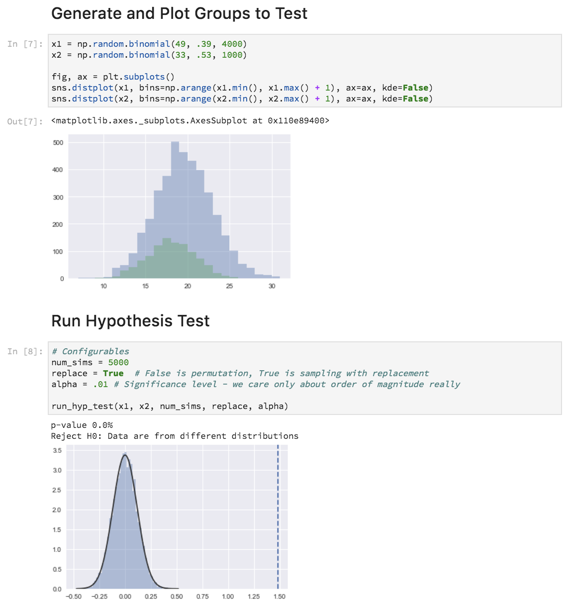

# Two-Sample Hypothesis Testing by Simulation
__[Framework](http://allendowney.blogspot.co.uk/2016/06/there-is-still-only-one-test.html)__ inspired by Allen Downey . 

A flexible simulation-based hypothesis testing framework to compute the statistical significance of the difference between two groups.

"Analytic methods were necessary when computation was slow and expensive, but as computation gets cheaper and faster, they are less appealing because they are inflexible and opaque."

## Methodology

## Screenshot

